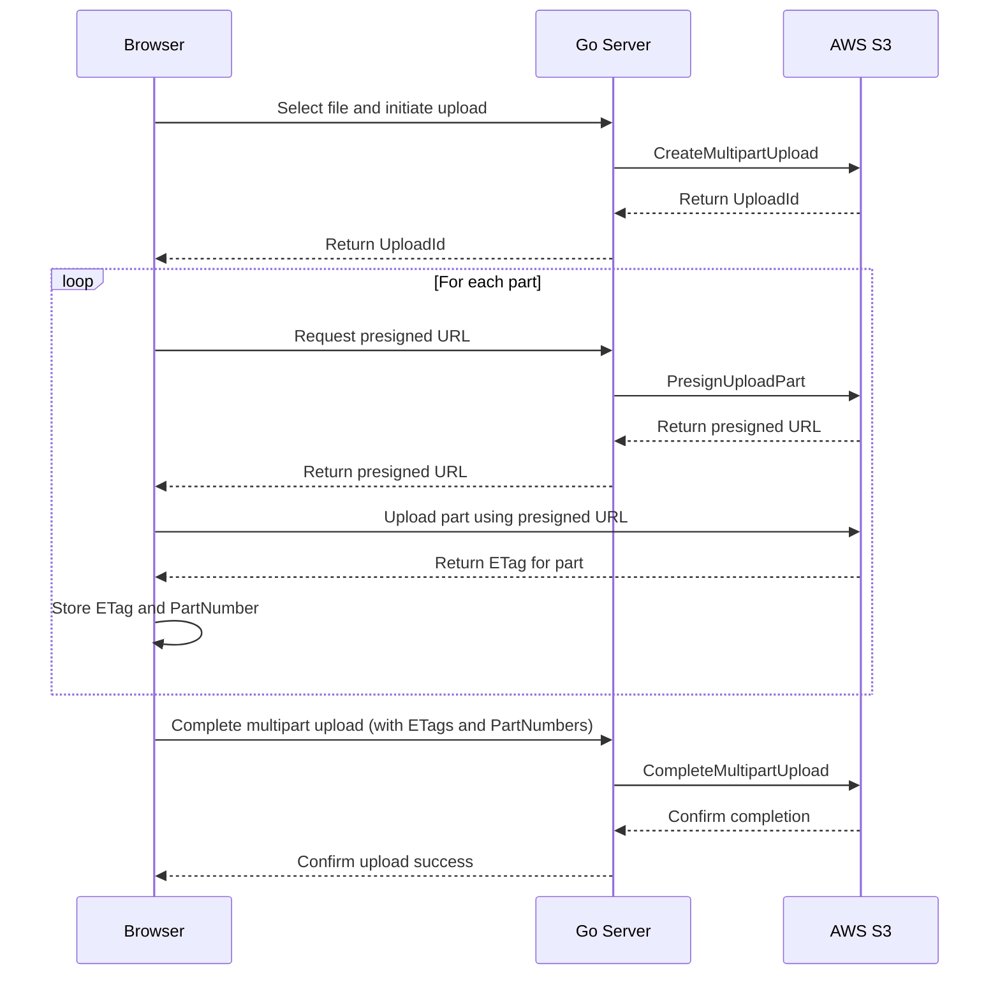

# S3 CORS configuration
```json
[
    {
        "AllowedHeaders": [
            "*"
        ],
        "AllowedMethods": [
            "PUT",
            "POST",
            "DELETE"
        ],
        "AllowedOrigins": [
            "http://localhost:8080"
        ],
        "ExposeHeaders": [
            "ETag"
        ]
    }
]
```

# Flow


# Etag
- etag from S3 is md5(blob)
- putObject returns etag
- client-side calculated md5 is compared with etag from S3
- if they are different, the part is re-uploaded
- at completeMultipartUpload, the etags are verified again
- if any etag is different, the whole multipart upload is aborted and re-uploaded